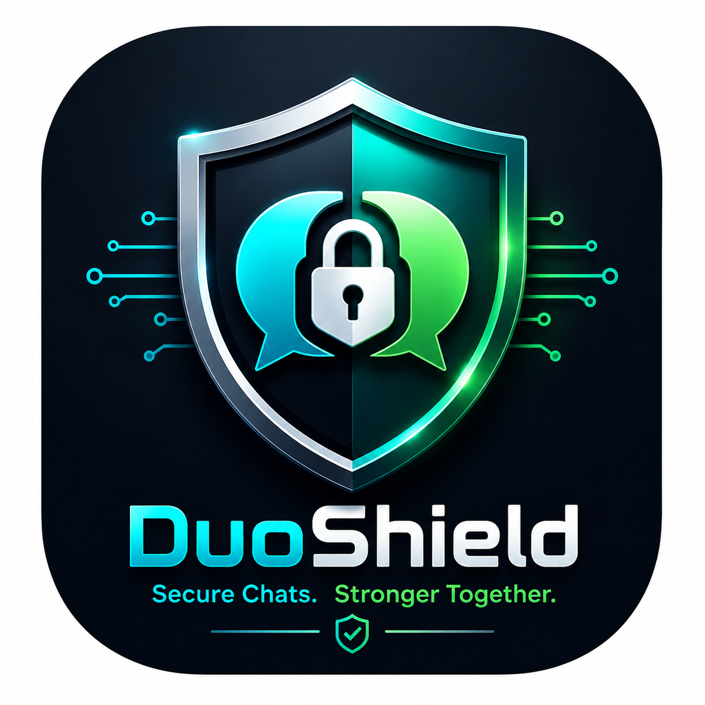
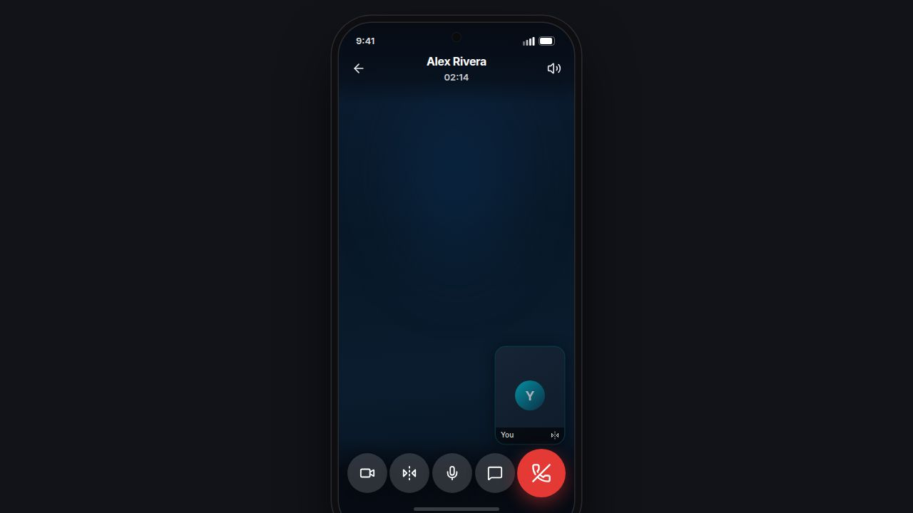
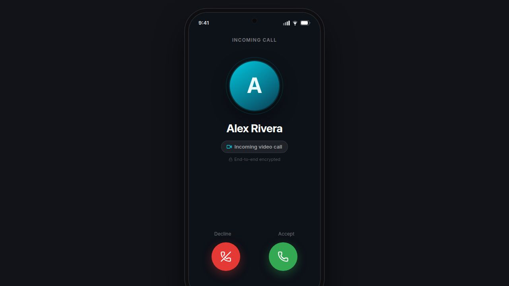
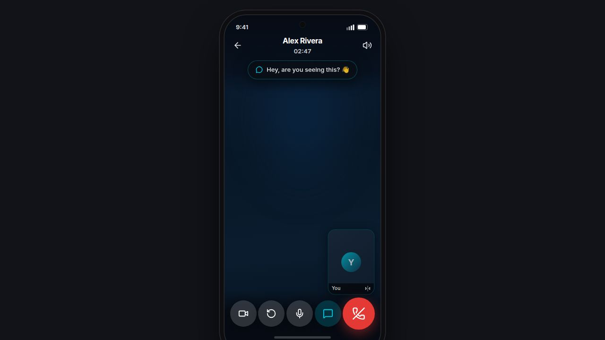

<div align="center">



# DuoShield

**Military-grade end-to-end encrypted messaging for Android.**  
No servers read your messages. No metadata sold. No backdoors.

<br/>

[](https://github.com/kumarclaude4-hash/DuoFatass/actions/workflows/ci.yml)
[](https://github.com/kumarclaude4-hash/DuoFatass/actions/workflows/release.yml)
[](https://developer.android.com)
[](https://developer.android.com/about/versions/oreo)
[](https://signal.org/docs/)
[](#changelog)
[](#license)

<br/>

[Features](#-features) · [Screenshots](#-screenshots) · [Architecture](#-architecture) · [Building](#-building) · [Infrastructure](#-infrastructure) · [Security](#-security) · [Contributing](#-contributing) · [Changelog](#-changelog)

</div>

> **Current status:** The `main` branch includes the latest call, message decryption, profile-photo, voice-message, notification, and secure in-app update fixes. The current release line is **v1.4**.

---

## 🆚 Why DuoShield?

| Feature | DuoShield | WhatsApp | Signal | Telegram |
|---|:---:|:---:|:---:|:---:|
| Signal Protocol E2EE | ✅ | ✅ | ✅ | ❌ opt-in |
| Post-Quantum (PQXDH + Kyber-1024) | ✅ | ❌ | ✅ | ❌ |
| No phone number required | ✅ | ❌ | ❌ | ❌ |
| Encrypted local DB (SQLCipher) | ✅ | ❌ | ✅ | ❌ |
| Encrypted media at rest | ✅ | ❌ | ✅ | ❌ |
| Seed-phrase account restore | ✅ | ❌ | ❌ | ❌ |
| No cloud backup of keys | ✅ | ❌ | ✅ | ❌ |
| Encrypted voice & video calls | ✅ | ✅ | ✅ | ✅ |
| Safety number verification | ✅ | ❌ | ✅ | ❌ |

---

## ✨ Features

<table>
<tr>
<td width="50%">

### 🔐 Cryptography
- **Signal Protocol** — Double Ratchet + X3DH (PQXDH with Kyber-1024)
- **AES-256-GCM** throughout — group keys, media, voice notes, backups
- **SQLCipher** — DB key derived via HKDF-SHA256 from UID
- **PBKDF2-HMAC-SHA256** — 310 000 iterations for PIN hashing
- **Pre-keys** — weekly rotation; batch upload of 25 when below 10

### 💬 Messaging
- **1-to-1 and group chats** — real-time via Firestore + FCM
- **Voice messages** — AES-256-GCM encrypted with waveform scrubbing and inline WhatsApp-style upload progress
- **Durable decryption recovery** — raw ciphertext is persisted immediately; failed messages retry automatically with backoff or by tapping the message
- **Media sharing** — up to 500 MB; 50 MB+ videos stream-encrypt to disk
- **Reactions, reply, forward, edit, star, pin** — full action sheet
- **Smart notifications** — notifications are suppressed only inside the exact active conversation; the conversation list and other screens still notify
- **Disappearing messages** — per-conversation timer
- **Link previews** — inline domain + title cards

</td>
<td width="50%">

### 🛡️ Security
- **App lock** — PIN with configurable auto-lock
- **Safety numbers** — Signal-style identity verification
- **Delivery & read receipts** — FCM-backed with status downgrade guard
- **Self-destruct** — scheduled remote wipe via Cloud Function

### 📞 Calls
- **WebRTC E2EE voice + video** — DTLS-SRTP, TURN via Cloudflare
- **Reliable call flow** — standard voice/video calls no longer depend on the removed recording flow that caused false “partner refused recording” failures
- **Adaptive bitrate** — Bandwidth Estimation on 64-bit devices
- **100 GB/user/month** TURN relay; usage shown in Settings

### 🔑 Account & Recovery
- **24-word seed phrase** — entire identity derived deterministically
- **No phone number or email** — UID format: `XXXXX-XXXXX-XXX`
- **Encrypted backup & restore** — PBKDF2-protected, seed-phrase based
- **In-app updates** — checks the latest GitHub release, downloads the device-compatible APK, verifies SHA-256, and installs without requiring a new login

</td>
</tr>
</table>

---

## 📸 Screenshots

<div align="center">

| Video Call | Incoming Call | Call Banner |
|:---:|:---:|:---:|
|  |  |  |

</div>

---

## 🏗 Architecture

DuoShield is **client-heavy by design** — the server is a stateless FCM relay; all cryptographic operations happen on device.

```
┌────────────────────────────────────────────────────┐
│                   Android Client                   │
│                                                    │
│  Signal Protocol ─── Room (SQLCipher) ─── Firestore│
│                          │                         │
│                      UI Layer                      │
└──────────────┬─────────────────────────┬───────────┘
               │                         │
               ▼                         ▼
       ┌──────────────┐         ┌─────────────────┐
       │   Firebase   │         │  Cloudflare     │
       │   Firestore  │         │  Worker (R2→B2) │
       │  (ciphertext │         │  encrypted media│
       │   + metadata)│         └─────────────────┘
       └──────┬───────┘
              │ FCM
              ▼
       ┌──────────────┐
       │  Push relay  │  Node.js · Render.com
       │  (stateless) │  /server
       └──────────────┘
```

→ Full module layout, Firestore schema, and contributor invariants: **[docs/ARCHITECTURE.md](docs/ARCHITECTURE.md)**

---

## 🔨 Building

### Prerequisites

| Tool | Version |
|---|---|
| Java | 17 (Temurin) |
| Android SDK | API 34, build-tools 34.0.0 |
| Gradle | 8.7 (wrapper included) |

### Debug build (CI / compile check)

```bash
echo "sdk.dir=$ANDROID_SDK_ROOT" > local.properties
./gradlew :app:compileDebugJavaWithJavac --no-daemon
```

### Signed release APK (GitHub Actions)

Triggered automatically on every push to `main` via [`.github/workflows/release.yml`](.github/workflows/release.yml).  
Required repository secrets:

| Secret | Purpose |
|---|---|
| `GOOGLE_SERVICES_JSON` | Firebase config |
| `GOOGLE_APPLICATION_CREDENTIALS_JSON` | FCM service account |
| `KEYSTORE_BASE64` | Base64-encoded release keystore |
| `KEYSTORE_PASSWORD` / `KEY_ALIAS` / `KEY_PASSWORD` | Signing credentials |
| `WORKER_URL` / `WORKER_SECRET` | Cloudflare Worker for media |

The release workflow publishes ABI-specific signed APKs (`arm64-v8a` and `armeabi-v7a`), matching ZIP archives, and a `SHA256SUMS` manifest through GitHub Releases. The in-app updater selects the compatible APK and verifies it before installation.

### In-app updates

From **Settings → Check for updates**, DuoShield checks the latest GitHub release over HTTPS. It downloads only the APK matching the device ABI, verifies the downloaded bytes against the release’s `SHA256SUMS` entry, confirms the archive package name, and then hands the file to Android’s package installer. Updates use the existing app data directory, so the local encrypted database, preferences, and login session are preserved when Android accepts the upgrade signed with the same release key.

### Firestore

```bash
# Deploy security rules
firebase deploy --only firestore:rules

# Deploy composite indexes
firebase deploy --only firestore:indexes

# Run rules unit tests locally
cd firestore-tests && npm install
firebase emulators:exec --only firestore "npm test"
```

---

## 🌐 Infrastructure

```
GitHub repo
    │
    ├─ push to main
    │       ├──► Render.com          (auto-deploy /server — FCM push relay)
    │       └──► Cloudflare Workers  (auto-deploy /worker — R2→B2 tiered media)
    │
    └─ GitHub Actions CI/CD
            ├── Lint + compile check  (every push / PR)
            ├── Debug APK build       (every push / PR)
            ├── Signed release APK    (every push to main)
            └── Firestore rules test  (on rules/test file changes)
```

| Service | Repo path | Live URL | Auto-deploy |
|---|---|---|---|
| Push server (FCM relay) | `/server` | `https://duofat.onrender.com` | ✅ on `git push` |
| Storage Worker (R2 → B2) | `/worker` | Cloudflare Workers | ✅ on `git push` |
| Android app | `/app` | GitHub Releases (APK) | ✅ on `git push` |

---

## 🔒 Security

Vulnerability disclosures → **[SECURITY.md](SECURITY.md)**

### Key design decisions

| Decision | Rationale |
|---|---|
| On-device encryption only | Plaintext never leaves the device; server stores only ciphertext |
| PQXDH + Kyber-1024 | Post-quantum resistance for new sessions; legacy accounts auto-upgraded at launch |
| Zero-knowledge DB | SQLCipher key = `HKDF-SHA256(UID)`; inaccessible without the seed phrase |
| `FirebaseCostGuard` singleton | All Firestore reads/writes gated; prevents runaway listener cost |
| `AppLockManager` ref-count | `AtomicInteger` lifecycle prevents lock bypass on rapid resume/background |
| Status downgrade guard | Any `status` write transactions against `read → delivered` regression |

---

## 🤝 Contributing

Read **[CONTRIBUTING.md](CONTRIBUTING.md)** before opening a PR.  
For bugs use the [bug report template](.github/ISSUE_TEMPLATE/bug_report.yml).  
For features use the [feature request template](.github/ISSUE_TEMPLATE/feature_request.yml).

> **Security issues** — do **not** open a public issue. See [SECURITY.md](SECURITY.md).

---

## 📋 Changelog

See **[CHANGELOG.md](CHANGELOG.md)** for the full release history.

**Latest — v1.4**
- Secure GitHub-release in-app updates with ABI selection, SHA-256 verification, package validation, and FileProvider-scoped APK installation
- Standard WebRTC voice/video calls with the broken recording-dependent refusal path removed
- Durable recovery for messages that previously remained stuck on `[Decrypting...]`, including persisted ciphertext, automatic retries, and manual retry
- Generation-based profile-photo synchronization so a newly selected avatar is not overwritten by a stale callback on the owner’s device
- Inline voice-message upload bubbles that update in place instead of blocking the conversation with a full-screen upload overlay
- Smart notification filtering that suppresses alerts only while the recipient is inside the exact conversation receiving the message
- Swipe-to-archive conversations with undo Snackbar
- Animated typing indicator in conversation list
- Waveform scrubbing for voice messages
- Avatar full-screen viewer + local cache
- B2 media request deduplication
- Vivid lavender `#9A81FF` accent; blue-tinted dark backgrounds

---

## 📄 License

**Proprietary — all rights reserved.**  
No part of this source code may be reproduced, distributed, or used in any form without explicit written permission from the author.

---

<div align="center">

Built with 🔐 and ☕ — because privacy is a right, not a feature.

</div>
